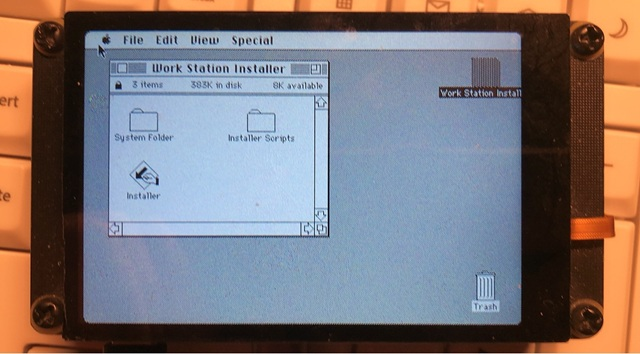

# Porting uMac for Pico DM QD3503728



### Note: Currently, only the RP2350 platform is supported.

## Get started
```bash
git clone https://github.com/embeddedboys/pico_dm_qd3503728_umac
cd pico_dm_qd3503728_umac
git submodule update --init --recursive
```

## Setup

This will use default settings, for more details please refer to [Configs](#configs)

### Raspberry Pi Pico (RP2040)
```bash
mkdir -p build && cd build
cmake .. -G Ninja
ln -sf $PWD/compile_commands.json ../
```

### Raspberry Pi Pico2 (RP2350)
```bash
mkdir -p build-pico2 && cd build-pico2
cmake -DPICO_BOARD=pico2 .. -G Ninja
ln -sf $PWD/compile_commands.json ../
```

## Configs

### MEMSIZE

- Default value : 128 (KB)

Memory size (in KB) reserved for the uMac emulator

```bash
cmake -DPICO_BOARD=pico2 -DMEMSIZE=128 .. -G Ninja
```

### DISP_WIDTH

- Default value : 480 (pixel)

The display width for uMac emulator

### DISP_HEIGHT

- Default value : 320 (pixel)

The display height for uMac emulator

## Roms and Discs

- Default ROM : `4D1F8172 - MacPlus v3.ROM`
- Default Disc : `system3.3-finder5.5-en.img`

### Replace Rom

...

### Replace Disc

...

## Build & flash target

### Use debugprobe
```bash
ninja flash
```

### or copy uf2 file to a mounted pico

```bash
ninja && cp src/pico_dm_qd3503728_umac.uf2 /media/developer/RP2350
```
